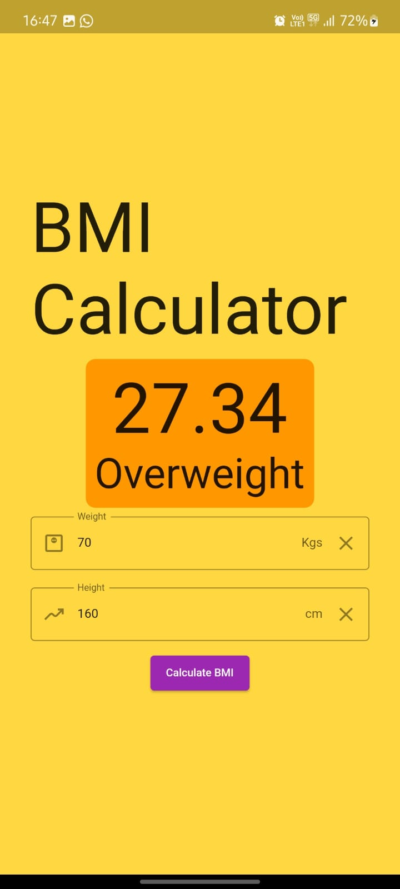
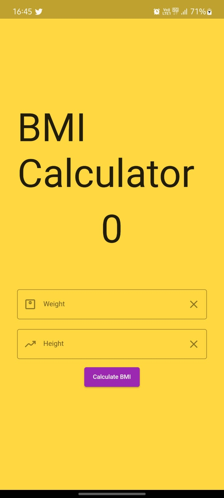
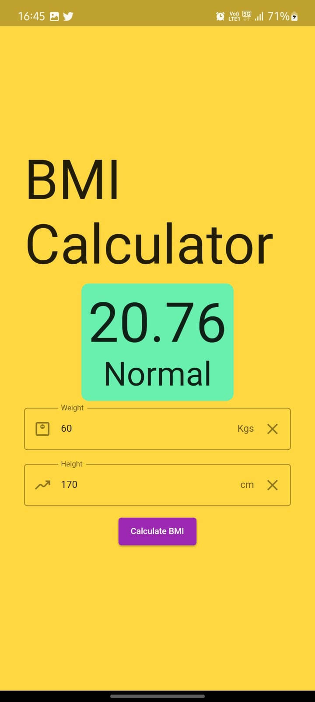
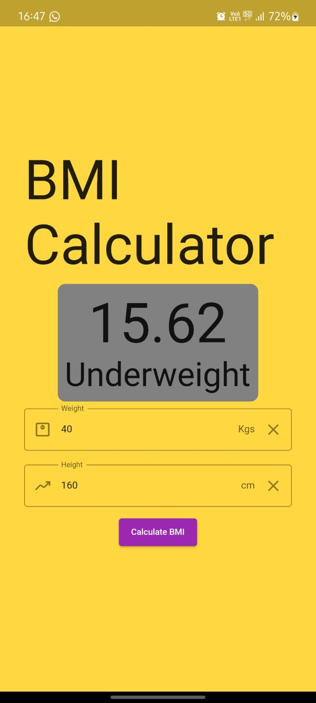
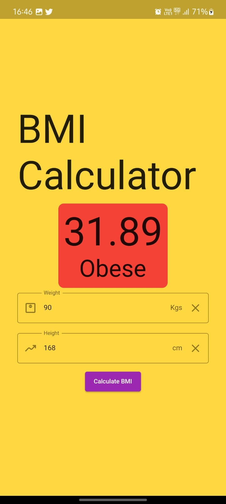

# SpaceTonic

BMI calculator using flutter.

# GDSC Tasks

## APP

- [SpaceTonic](https://github.com/vinay-04/bmicalculator)
- [Neom](https://github.com/vinay-04/Neom)

## Backend

- [Store My Files](https://github.com/vinay-04/StoreMyFiles)
- [Pet Store API](https://github.com/vinay-04/Pet-Store-API)
